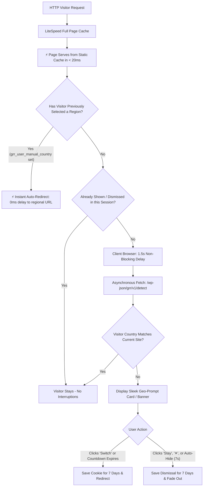
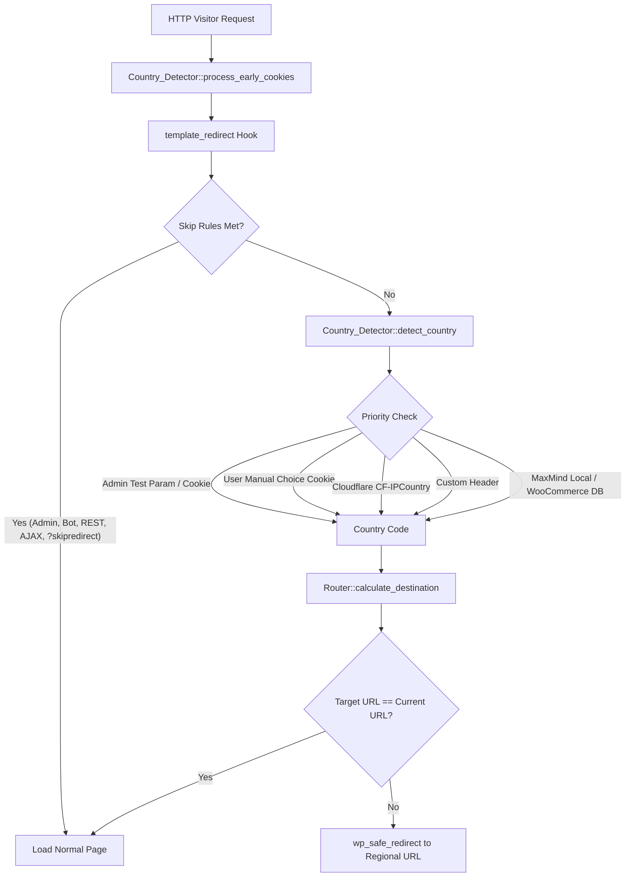

# 🌐 Geo Regional Router for WordPress Multisite

[](https://php.net)
[](https://wordpress.org)
[](https://wordpress.org/support/article/create-a-network/)
[](https://github.com/shubashbiswas/wordpress-multisite-redirect)
[](https://www.gnu.org/licenses/gpl-2.0.html)

**Geo Regional Router** is a high-performance, production-ready WordPress Multisite plugin that implements automatic, country-based URL routing across multi-regional WordPress installations (e.g., Global `/`, Bangladesh `/bd/`, and India `/in/`).

---

## 🌟 Key Features

- **⚡ 100% LiteSpeed Full Page Cache Compatible (Static First + Geo-Prompt)**: Serves every URL (`/`, `/bd/`, `/in/`) instantly in < 20ms from static page cache, followed by an asynchronous background GeoLite2 check that displays a sleek regional switch prompt or countdown.
- **🚀 Instant Auto-Redirect for Returning Visitors**: If a visitor previously clicked "Switch" or selected a country, they are **instantly and automatically redirected** to their preferred regional subsite with 0ms delay on subsequent visits without seeing the prompt again.
- **🕒 7-Day Decision Retention**: Remembers visitor choices (switching or choosing to stay) for **7 days** (configurable from session up to 30 days) across both server and client engines.
- **✨ Smooth Auto-Hide Notification**: If an undecided visitor ignores the prompt, it automatically slides down and fades away after **7 seconds** (configurable), saving their preference to stay on the current site.
- **🛡️ Once-Per-Session Display Guard**: Guarantees first-time visitors are never nagged across multiple page views during the same browsing session.
- **⚡ Zero-Impact WooCommerce MaxMind Auto-Discovery**: Automatically detects and shares WooCommerce's existing `GeoLite2-Country.mmdb` database and its weekly automated updates, saving disk space (~70MB) and RAM without requiring duplicate license keys.
- **🎨 Built-in Footer Country Switcher (`wp_footer`)**: Injects a clean, responsive regional switcher in the theme footer without editing code. Supports inline flags, pill buttons, or micro dropdowns with center, left, or right alignment.
- **🎨 Theme-Embedded Visitor Switcher Shortcode**: `[geo_regional_switcher style="inline"]` for embedding dropdowns, flags, or buttons directly inside Blocksy, Gutenberg, Elementor, or classic PHP theme files.
- **🔍 Auto SEO hreflang Tags**: Injects `<link rel="alternate" hreflang="...">` tags into page `<head>` for `x-default`, `bn-BD`, and `hi-IN`.
- **⚡ Edge Cache Helper (`Vary` Header)**: Sends `Vary: CF-IPCountry, Accept-Language` response headers to prevent CDNs (Cloudflare, LiteSpeed, Nginx, Varnish) from caching wrong regional redirects.
- **🛠️ Admin Bar Quick Switcher**: Adds a 1-click test mode switcher directly into the top WordPress Admin Bar for Network Administrators.
- **📊 Diagnostic Tool**: Built-in interactive URL routing simulator and privacy-compliant debug logger (automatic IP redaction).

---

## 🏗️ Architecture Overview

The plugin provides **two powerful architectural modes**:

### Mode 1: Client-Side Geo-Prompt (Default & LiteSpeed Full Page Cache Compatible)


### Mode 2: Immediate 302 Redirect Engine (Backend PHP)


---

## 🚀 Quick Start & Installation

1. Upload the plugin folder to `/wp-content/plugins/wordpress-multisite-redirect/`.
2. Go to **My Sites > Network Admin > Plugins** and click **Network Activate**.
3. Navigate to **Network Admin > Settings > Geo Regional Router**.
4. Under **General & Site Mapping**:
   - **Routing Architecture Mode**: Keep set to **Client-Side Geo-Prompt** *(Recommended for LiteSpeed Cache)*.
   - **Remember Routing Decision**: Choose **7 Days (Recommended)**.
   - Assign **Global / Default Site** (e.g. `https://domain.com/`).
   - Assign **Bangladesh Site** (e.g. `https://domain.com/bd/`).
   - Assign **India Site** (e.g. `https://domain.com/in/`).
   - Check **Enable Routing** and click **Save Network Settings**.
5. Under **SEO & Edge Cache & UI**:
   - Choose prompt layout: **Floating Card (Bottom-Right)**, **Top Notification Bar**, or **Center Modal Dialog**.
   - Configure **Display Delay** (default: `1.5s`) and **Auto-Hide Notification** (default: `7s`).
   - Optionally enable **Display Country Switcher in website footer (`wp_footer`)**.

> **💡 Zero Configuration for WooCommerce MaxMind:**  
> If your site has WooCommerce installed with MaxMind Geolocation enabled, you do **not** need to enter a database path or license key in Geo Regional Router. The plugin automatically discovers WooCommerce's database (`wp-content/uploads/woocommerce_uploads/*GeoLite2-Country.mmdb`) and inherits WooCommerce's automated weekly updates!

---

## ⚡ LiteSpeed Cache (LSCache) Optimal Setup

To ensure LiteSpeed Cache delivers maximum page speed without interfering with regional routing:

1. **Preset**: Use **Advanced (Recommended)** or **Essentials**. Avoid **Extreme** or **Aggressive**.
2. **Guest Mode**: Must be **OFF** ❌ in **LiteSpeed Cache > General** (prevents stripped IP vary HTML on first visits).
3. **JS Excludes**: In **LiteSpeed Cache > Page Optimization > JS Settings**, add:
   ```text
   grr-prompt
   ```
   to **JS Excludes** and **JS Deferred / Delayed Excludes**. This ensures the routing script executes immediately on page load without waiting for user scroll.

---

## 🎨 Frontend Regional Switcher & Full-Screen Modal

The plugin provides a unified, Apple/Nike-style regional selector:

### 🌐 Universal Theme Integration (Works in 100% of WordPress Themes):

The Region Switcher can be embedded anywhere on any theme using your preferred method:

1. **Shortcode (Page Builders & Customizers)**:
   * **Compact Pill (for Headers next to Cart)**:
     ```text
     [geo_regional_switcher style="cart"]
     ```
     *(Outputs: `📍 BD` with map logo and country code).*
   * **Full Button (for Footers & Bars)**:
     ```text
     [geo_regional_switcher style="footer"]
     ```
     *(Outputs: `📍 Region: BD ▾`).*
   * *Works inside Blocksy Header Builder (HTML element), Elementor, Divi, Astra, Kadence, Bricks, and Gutenberg.*

2. **WordPress Navigation Menus (Zero-code across ALL themes)**:
   * Go to **Appearance > Menus**.
   * Add a **Custom Link**:
     * **URL**: `#region-modal`
     * **Link Text**: `Region` (or `📍 BD`)
   * Save Menu. The plugin automatically converts this into an interactive regional trigger that opens the full-screen modal!

3. **Gutenberg Block (Block Themes & Full Site Editing / FSE)**:
   * In the Block Editor or Site Editor (**Appearance > Editor**), click `+` and insert the **Regional Store Switcher** block (`grr/region-switcher`).
   * Select your desired style (**Compact Pill** or **Full Button**).

4. **Classic WordPress Widget**:
   * Go to **Appearance > Widgets**.
   * Drag the **Regional Store Switcher** widget into any widget area (Header, Top Bar, Sidebar, or Footer).

5. **PHP Template Tag (For Developers)**:
   ```php
   <?php grr_region_switcher('cart'); ?>
   ```
   Or via action hook:
   ```php
   <?php do_action('grr_region_switcher'); ?>
   ```

---

---

### 🖥️ Full-Screen Regional Store Selector (Modal Overlay):
* **Modern Frosted Glass Dialog**:
  * Clicking any Regional Switcher trigger (Block, Widget, Shortcode, Menu link `#region-modal`, or Header Cart item) opens a full-screen frosted glass overlay (`backdrop-filter: blur(20px)`).
  * Displays distinct regional store cards:
    * **Global Store** (`🌐 Global / International` • USD $)
    * **Bangladesh Store** (`🇧🇩 Bangladesh` • BDT ৳ • বাংলা)
    * **India Store** (`🇮🇳 India` • INR ₹ • English)
  * Active region is highlighted with an illuminated `✓ Current Region` badge.
  * Dismissible via `Esc` key, background click, or top-right `✕` button.

---

## 🧪 Admin Testing URLs

* **Simulate Bangladesh Visitor**:  
  `https://yourdomain.com/?grr_test_country=BD`
* **Simulate India Visitor**:  
  `https://yourdomain.com/?grr_test_country=IN`
* **Reset Saved Visitor Preferences**:  
  `https://yourdomain.com/?grr_set_country=RESET`
* **Bypass All Redirection**:  
  `https://yourdomain.com/?skipredirect=1`
