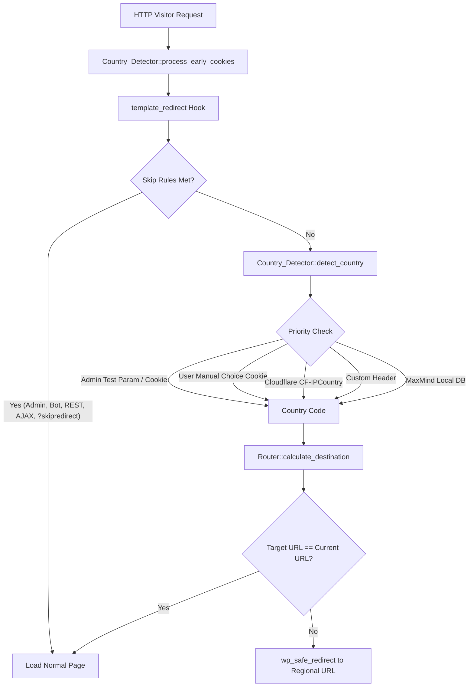

# 🌐 Geo Regional Router for WordPress Multisite

[](https://php.net)
[](https://wordpress.org)
[](https://wordpress.org/support/article/create-a-network/)
[](https://www.gnu.org/licenses/gpl-2.0.html)

**Geo Regional Router** is a complete, production-ready, standalone WordPress Multisite plugin that implements automatic, country-based URL routing across multi-regional WordPress installations (e.g., Global `/`, Bangladesh `/bd/`, and India `/in/`).

---

## 🌟 Key Features

- **⚡ Dynamic Geographic Routing**: Automatically routes visitors to their country's designated site (`BD` → `/bd/`, `IN` → `/in/`, All others → Global `/`).
- **🔀 Cross-Regional Correction**: Seamlessly corrects direct access to wrong regional URLs (e.g., an Indian visitor accessing `https://domain.com/bd/about/` is routed to `https://domain.com/in/about/`).
- **🔗 Path & Query String Preservation**: Preserves relative paths (`/about/`, `/products/example/`) and all query parameters (`utm_*`, `fbclid`, `gclid`, custom args).
- **🚫 Loop & Double-Prefix Prevention**: Normalizes URLs to guarantee zero redirect loops or double prefixes (e.g., never produces `/bd/bd/`).
- **🛡️ Multi-Priority GeoIP Detection**:
  1. Admin Test Override (`?grr_test_country=BD`)
  2. Visitor Manual Switcher Preference (`?grr_set_country=BD`)
  3. Cloudflare `CF-IPCountry` Header
  4. Configured Custom Proxy Header (e.g., `HTTP_X_GEOIP_COUNTRY`)
  5. Local MaxMind GeoLite2 `.mmdb` Binary Database
- **🎨 Theme-Embedded Visitor Switcher**: Shortcode `[geo_regional_switcher]` for embedding inline dropdowns, flags, or pill buttons directly inside any theme without popups.
- **🔍 Auto SEO hreflang Tags**: Injects `<link rel="alternate" hreflang="...">` tags into page `<head>` for `x-default`, `bn-BD`, and `hi-IN`.
- **⚡ Edge Cache Helper (`Vary` Header)**: Sends `Vary: CF-IPCountry, Accept-Language` response headers to prevent CDNs (Cloudflare, LiteSpeed, Nginx, Varnish) from caching wrong regional redirects.
- **🛠️ Admin Bar Quick Switcher**: Adds a 1-click test mode switcher directly into the top WordPress Admin Bar for Network Administrators.
- **📊 Diagnostic Tool**: Built-in interactive URL routing simulator and privacy-compliant debug logger.

---

## 🏗️ Architecture Overview



---

## 🚀 Quick Start & Installation

1. Upload the `multisite-redirect` plugin directory to `/wp-content/plugins/`.
2. Go to **My Sites > Network Admin > Plugins** and click **Network Activate**.
3. Navigate to **Network Admin > Settings > Geo Regional Router**.
4. Under **General & Site Mapping**:
   - Assign **Global / Default Site** (e.g. `https://domain.com/`).
   - Assign **Bangladesh Site** (e.g. `https://domain.com/bd/`).
   - Assign **India Site** (e.g. `https://domain.com/in/`).
   - Select Redirect Status Code (Default: `302 Found`).
   - Check **Enable Routing** and click **Save Network Settings**.

---

## 🎨 Theme Integration (Frontend Switcher)

Embed the regional switcher anywhere in your theme without popups:

### 1. Block Themes (Gutenberg / FSE / Site Editor)
Add a **Shortcode Block** to your Header or Footer pattern:
- **Dropdown Style** (Default): `[geo_regional_switcher]`
- **Pill Buttons Style**: `[geo_regional_switcher style="buttons"]`
- **Flags Style**: `[geo_regional_switcher style="flags"]`

### 2. Classic PHP Themes (`header.php`, `footer.php`)
Place this code snippet anywhere in your PHP template files:
```php
<?php if ( shortcode_exists( 'geo_regional_switcher' ) ) : ?>
    <div class="header-regional-switcher">
        <?php echo do_shortcode( '[geo_regional_switcher]' ); ?>
    </div>
<?php endif; ?>
```

### 3. Floating Corner Widget
Enable **"Automatically render floating regional switcher in bottom-right corner"** in **Network Admin > Settings > Geo Regional Router > SEO & Edge Cache & UI**.

---

## ⚙️ Configuration Tabs

| Tab Name | Description |
| :--- | :--- |
| **General & Site Mapping** | Enable/disable router, assign Multisite Blog IDs to regional roles, set status code (302/307/301/308), configure cookie persistence. |
| **Exclusions & Bypasses** | Skip rules for logged-in admins, logged-in users, crawlers/bots, REST API (`/wp-json/`), AJAX, Cron, Admin URLs, XML-RPC, RSS feeds, Sitemaps, and Previews. |
| **Country Detection** | Cloudflare `CF-IPCountry`, Custom HTTP Header name, Trusted Proxy IP ranges (CIDR support), MaxMind database path & License key for auto-updates. |
| **SEO & Edge Cache & UI** | Auto-inject `hreflang` meta tags, send `Vary` edge cache headers, Admin Bar Quick Switcher, Frontend Switcher settings. |
| **Diagnostics Tool** | Real-time URL routing simulator & debug log manager. |

---

## 🧪 Verification & Test Matrix

| Test Case | Scenario | Visitor Country | Requested URL | Resulting Destination |
| :---: | :--- | :---: | :--- | :--- |
| **A** | Root Home | `BD` | `https://domain.com/` | `https://domain.com/bd/` |
| **B** | Inner Path | `BD` | `https://domain.com/about/` | `https://domain.com/bd/about/` |
| **C** | Root Home | `IN` | `https://domain.com/` | `https://domain.com/in/` |
| **D** | Inner Path | `IN` | `https://domain.com/about/` | `https://domain.com/in/about/` |
| **E** | Root Home | `US` | `https://domain.com/` | No redirect (Stays on Global `/`) |
| **F** | Inner Path | `US` | `https://domain.com/about/` | No redirect (Stays on Global `/about/`) |
| **G** | Cross-Regional | `IN` | `https://domain.com/bd/about/` | `https://domain.com/in/about/` |
| **H** | Cross-Regional | `BD` | `https://domain.com/in/about/` | `https://domain.com/bd/about/` |
| **I** | Cross-Regional | `US` | `https://domain.com/bd/about/` | `https://domain.com/about/` |
| **J** | Cross-Regional | `US` | `https://domain.com/in/about/` | `https://domain.com/about/` |
| **K/L** | Loop Guard | `BD`/`IN` | `/bd/about/` or `/in/about/` | No redirect (Loop prevention) |
| **M/N** | Query Params | `BD` | `/about/?utm_source=google` | `/bd/about/?utm_source=google` |
| **O/P** | Bypass Parameter | Any | `/about/?skipredirect` | No redirect |
| **T/U** | Edge Case | Any | `/bd/about/` or `/in/about/` | Never produces `/bd/bd/about/` |

---

## 🪝 Developer Hooks & Filters

Customize routing logic programmatically in your custom theme or mu-plugins:

```php
// Filter detected country code
add_filter( 'geo_regional_router_country', function( $country, $current_url ) {
    if ( strpos( $current_url, '/special-partner/' ) !== false ) {
        return 'BD';
    }
    return $country;
}, 10, 2 );

// Block redirect for specific condition
add_filter( 'geo_regional_router_should_redirect', function( $should_redirect, $current_url, $target_url, $country ) {
    if ( is_page( 'landing-page' ) ) {
        return false; // Prevent redirection on landing page
    }
    return $should_redirect;
}, 10, 4 );

// Modify target redirect URL
add_filter( 'geo_regional_router_redirect_url', function( $target_url, $current_url, $country ) {
    return $target_url;
}, 10, 3 );
```

---

## 🔒 Security & Privacy

- **IP Protection**: Visitor IP addresses are sanitized and never written to debug log files.
- **Proxy Verification**: Proxy headers (`CF-IPCountry`, `X-GeoIP-Country`) are only trusted when originating from configured trusted proxy IP ranges.
- **Open Redirect Guard**: Destination URLs are strictly validated against home URLs of configured WordPress Multisite blogs.

---

## 📄 License

Geo Regional Router is licensed under the [GPL v2 or later](https://www.gnu.org/licenses/gpl-2.0.html).
